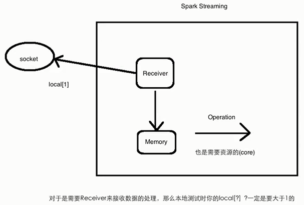
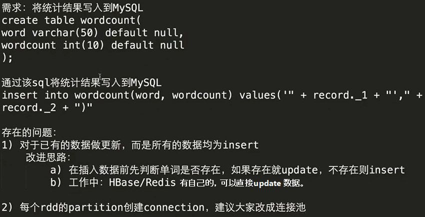
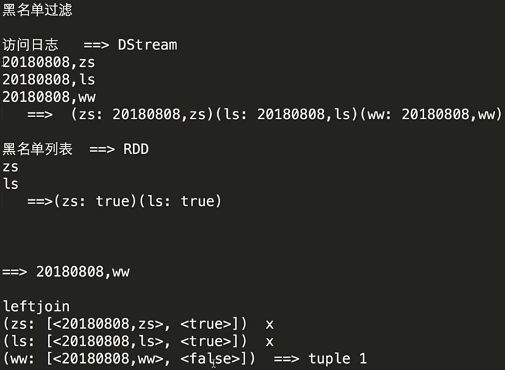
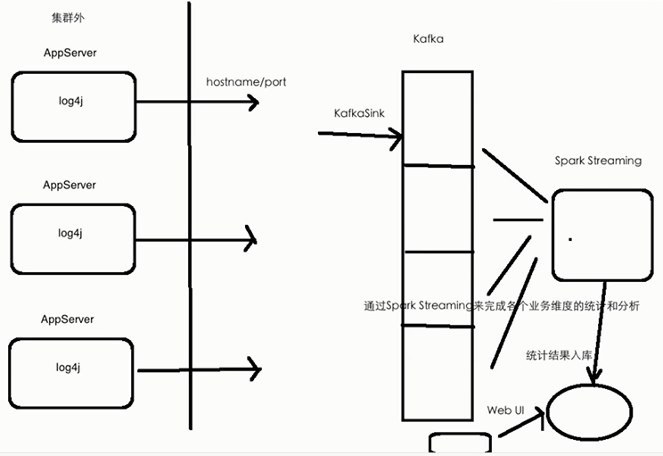

# Spark Streaming Real Project Tutorial

**Version:**

- Linux: Ubuntu 16.04
- Spark: 2.3.0
- Scala: 2.11.8
- Kafka: 0.9.0.0
- Flume: 1.7.0

---

## src/main/java/com/zhandev/spark/kafka

KafkaProducer.java produces messages and KafkaConsumer.java consumes messages.

**Steps:**

1. In terminal A, start ZooKeeper. Under `zookeeper/bin`, command line: `zkServer.sh start`.
2. In terminal B, start Kafka. Under `kafka_2.11-0.9.0.0`, command line: `bin/kafka-server-start.sh config/server.properties`.
3. In IDEA, run KafkaClientApp.java.
4. In IDEA console, you will see

```
Sent: message_1
Sent: message_2
receive: message_1
receive: message_2
...
```

---

## src/main/scala/com/zhandev/spark

### NetworkWordCount.scala

Spark Streaming receives socket data and does word count.

**Steps:**

1. In terminal A, `nc -lk 6789`.
2. In IDEA, run NetworkWordCount.scala.
3. In terminal A, type `a a a b b b b c c`.
4. In IDEA console, you will see

```
(b,4)
(a,3)
(c,2)
```

**Note:** There might be "NoSuchMethodError" exceptions. Just add corresponding Maven dependencies to solve the problem.



### FileWordCount.scala

Spark Streaming processes file system (local/hdfs) data and does word count.

**Steps:**

1. In IDEA, run FileWordCount.scala.
2. Type `a a a b b c` in file1.log file. Save.
3. Copy file1.log file to `/home/hadoop/IdeaProjects/sparktrain/src/main/resources/static/file`.
4. In IDEA console, you will see

```
(a,3)
(b,2)
(c,1)
```

### StatefulWordCount.scala

Spark Streaming processes socket data with state and does word count. The count will be accumulated based on previous result.

**Note:** If you use stateful operation，you must set checkpoint. In production environment, you should set checkpoint directory on HDFS.

**Steps:**

1. In terminal A, `nc -lk 6789`.
2. In IDEA, run StatefulWordCount.scala.
3. In terminal A, type `a a a b b b b c c`.
4. In IDEA console, you will see

```
(b,4)
(a,3)
(c,2)
```

5. In terminal A, type `a a b c c c`.
6. In IDEA console, you will see

```
(b,5)
(a,5)
(c,5)
```

### WordCountResultToMysql.scala

Spark Streaming processes socket data and save the wordcount result into MySQL.

**Note:** Remember to add MySQL Maven dependency in pom.xml file.

**Steps:**

1. In terminal A, start MySQL, `mysql -u root -p`. Enter password.
2. Create a database, `create database spark;`.
3. Use this database, `use spark`.
4. Create a table, `create table wordcount (word varchar(50) default null, count int(10) default null);`.
5. In terminal B, `nc -lk 6789`.
6. In IDEA, run WordCountResultToMysql.scala.
7. In terminal B, type `a a b c c c`.
8. In IDEA console, you will see

```
(b,1)
(a,2)
(c,3)
```

9. In terminal A, `select * from wordcount`. You will see

```
| b | 1 |
| a | 2 |
| c | 3 |
```



### BlacklistFiltering.scala

Use Spark Streaming to filter records of log data which are in blacklist.

**Steps:**

1. In terminal A, `nc -lk 6789`.
2. In IDEA, run BlacklistFiltering.scala.
3. In terminal A, type

```
20180101,zs
20180101,ls
20180101,ww
20180101,zl
```

4. In IDEA console, you will see the records with "zs" and "ls" have been filtered out.

```
20180101,ww
20180101,zl
```



### SparkSqlNetworkWordCount.scala

Integrate Spark Streaming and Spark SQL to process socket data and do word count. Convert RDDs of the words DStream to DataFrame and run SQL query.

**Note:** Remember to add spark-sql Maven dependency in pom.xml file.

**Steps:**

1. In terminal A, `nc -lk 6789`.
2. In IDEA, run SparkSqlNetworkWordCount.scala.
3. In terminal A, type `a a a b b b c c`.
4. In IDEA console, you will see

```
+----+-----+
|word|total|
+----+-----+
|   c|    2|
|   b|    3|
|   a|    3|
+----+-----+
```

### FlumePushWordCount.scala

Integrate Spark Streaming and Flume to process socket data and do word count in push-based approach.

**Note:**

- Remember to add spark-streaming-flume Maven dependency in pom.xml file.
- There are a bit differences between the flume config file and FlumePushWordCount file of local mode and server mode (in production environment).

#### local mode

**Steps:**

1. Create Flume config file (flume-push-streaming.conf).
2. In IDEA, run FlumePushWordCount.scala. Edit configurations -> Program arguments, input `10.0.2.15 41414`. -> Apply
3. In terminal A, start Flume.

```
flume-ng agent \
--name netcat-memory-avro \
--conf $FLUME_HOME/conf \
--conf-file /home/hadoop/IdeaProjects/sparktrain/src/main/resources/static/flume/flume-push-streaming.conf \
-Dflume.root.logger=INFO,console
```

4. In terminal B, `telnet localhost 44444`. Type `a a b b`.
5. In IDEA console, you will see

```
(a,2)
(b,2)
```

#### server mode (in production environment)

**Steps:**

1. In terminal A, pack the spark project using maven, under the spark project directory, `mvn clean package -DskipTests` (skip test). Then the .jar file will be created under "target" folder.
2. In terminal B, run the .jar file using spark-submit. (Need network to download packages, but in production environment, network will not be available. So you should use `--jars` instead of `--packages`.)

```
spark-submit \
--class com.zhandev.spark.FlumePushWordCount \
--master local[2] \
--packages org.apache.spark:spark-streaming-flume_2.11:2.3.0 \
/home/hadoop/IdeaProjects/sparktrain/target/spark-train-1.0.jar \
localhost 41414
```

3. In terminal C, start Flume.

```
flume-ng agent \
--name netcat-memory-avro \
--conf $FLUME_HOME/conf \
--conf-file /home/hadoop/IdeaProjects/sparktrain/src/main/resources/static/flume/flume-push-streaming.conf \
-Dflume.root.logger=INFO,console
```

4. In terminal D, `telnet localhost 44444`. Type `a a b b`.
5. In terminal B, you will see

```
(a,2)
(b,2)
```

### FlumePullWordCount.scala

Integrate Spark Streaming and Flume to process socket data and do word count in pull-based approach. Pull-based approach is better than push-based approach. Use pull-based one in real projects.

**Note:**

- Remember to add spark-streaming-flume-sink, scala-library, and commons-lang3 Maven dependencies in pom.xml file.
- There are a bit differences between the flume config file and FlumePushWordCount file of local mode and server mode (in production environment).
- Start Flume first, then start Spark Streaming.
- Remember to add spark-streaming-flume-sink_2.11-2.3.0.jar, scala-library-2.11.8.jar and commons-lang3-3.5.jar under `flume/lib` directory. Otherwise, you will get following exceptions.
- Pay attention to the version of .jar files.

```
org.apache.flume.FlumeException: Unable to load sink type: org.apache.spark.streaming.flume.sink.SparkSink, class: org.apache.spark.streaming.flume.sink.SparkSink
        at org.apache.flume.sink.DefaultSinkFactory.getClass(DefaultSinkFactory.java:71)
        at org.apache.flume.sink.DefaultSinkFactory.create(DefaultSinkFactory.java:43)
        at org.apache.flume.node.AbstractConfigurationProvider.loadSinks(AbstractConfigurationProvider.java:410)
        at org.apache.flume.node.AbstractConfigurationProvider.getConfiguration(AbstractConfigurationProvider.java:98)
        at org.apache.flume.node.PollingPropertiesFileConfigurationProvider$FileWatcherRunnable.run(PollingPropertiesFileConfigurationProvider.java:140)
        at java.util.concurrent.Executors$RunnableAdapter.call(Executors.java:471)
        at java.util.concurrent.FutureTask.runAndReset(FutureTask.java:304)
        at java.util.concurrent.ScheduledThreadPoolExecutor$ScheduledFutureTask.access$301(ScheduledThreadPoolExecutor.java:178)
        at java.util.concurrent.ScheduledThreadPoolExecutor$ScheduledFutureTask.run(ScheduledThreadPoolExecutor.java:293)
        at java.util.concurrent.ThreadPoolExecutor.runWorker(ThreadPoolExecutor.java:1145)
        at java.util.concurrent.ThreadPoolExecutor$Worker.run(ThreadPoolExecutor.java:615)
        at java.lang.Thread.run(Thread.java:744)
Caused by: java.lang.ClassNotFoundException: org.apache.spark.streaming.flume.sink.SparkSink
        at java.net.URLClassLoader$1.run(URLClassLoader.java:366)
        at java.net.URLClassLoader$1.run(URLClassLoader.java:355)
        at java.security.AccessController.doPrivileged(Native Method)
        at java.net.URLClassLoader.findClass(URLClassLoader.java:354)
        at java.lang.ClassLoader.loadClass(ClassLoader.java:425)
        at sun.misc.Launcher$AppClassLoader.loadClass(Launcher.java:308)
        at java.lang.ClassLoader.loadClass(ClassLoader.java:358)
        at java.lang.Class.forName0(Native Method)
        at java.lang.Class.forName(Class.java:190)
        at org.apache.flume.sink.DefaultSinkFactory.getClass(DefaultSinkFactory.java:69)
        ... 11 more
```

or `Did not receive events from Flume agent due to error on the Flume agent: begin() called when transaction is OPEN!`

#### server mode (in production environment)

**Steps:**

1. In terminal A, pack the spark project using maven, under the spark project directory, `mvn clean package -DskipTests` (skip test). Then the .jar file will be created under "target" folder.
2. In terminal B, start Flume.

```
flume-ng agent \
--name netcat-memory-spark \
--conf $FLUME_HOME/conf \
--conf-file /home/hadoop/IdeaProjects/sparktrain/src/main/resources/static/flume/flume-pull-streaming.conf \
-Dflume.root.logger=INFO,console
```

3. In terminal C, `telnet localhost 44444`.
4. In terminal D, run the .jar file using spark-submit. (Need network to download packages, but in production environment, network will not be available. So you should use `--jars` instead of `--packages`.)

```
spark-submit \
--class com.zhandev.spark.FlumePullWordCount \
--master local[2] \
--packages org.apache.spark:spark-streaming-flume_2.11:2.3.0 \
/home/hadoop/IdeaProjects/sparktrain/target/spark-train-1.0.jar \
localhost 41414
```

5. In terminal C, type `a a b b`.
6. In terminal D, you will see

```
(a,2)
(b,2)
```

### KafkaDirectWordCount.scala

Integrate Spark Streaming and Kafka to do word count in direct approach. Use direct approach in real projects.

**Note:**

- Remember to add spark-streaming-kafka-0-8_2.11 Maven dependency in pom.xml file.
- Comment kafka_2.11 Maven dependency in pom.xml file. Otherwise, you will get the following exception.

```
Exception in thread "main" java.lang.ClassCastException: kafka.cluster.BrokerEndPoint cannot be cast to kafka.cluster.Broker
	at org.apache.spark.streaming.kafka.KafkaCluster$$anonfun$2$$anonfun$3$$anonfun$apply$6$$anonfun$apply$7.apply(KafkaCluster.scala:98)
	at scala.Option.map(Option.scala:146)
	at org.apache.spark.streaming.kafka.KafkaCluster$$anonfun$2$$anonfun$3$$anonfun$apply$6.apply(KafkaCluster.scala:98)
	at org.apache.spark.streaming.kafka.KafkaCluster$$anonfun$2$$anonfun$3$$anonfun$apply$6.apply(KafkaCluster.scala:95)
	at scala.collection.TraversableLike$$anonfun$flatMap$1.apply(TraversableLike.scala:241)
	at scala.collection.TraversableLike$$anonfun$flatMap$1.apply(TraversableLike.scala:241)
	at scala.collection.IndexedSeqOptimized$class.foreach(IndexedSeqOptimized.scala:33)
	at scala.collection.mutable.WrappedArray.foreach(WrappedArray.scala:35)
	at scala.collection.TraversableLike$class.flatMap(TraversableLike.scala:241)
	at scala.collection.AbstractTraversable.flatMap(Traversable.scala:104)
	at org.apache.spark.streaming.kafka.KafkaCluster$$anonfun$2$$anonfun$3.apply(KafkaCluster.scala:95)
	at org.apache.spark.streaming.kafka.KafkaCluster$$anonfun$2$$anonfun$3.apply(KafkaCluster.scala:94)
	at scala.collection.TraversableLike$$anonfun$flatMap$1.apply(TraversableLike.scala:241)
	at scala.collection.TraversableLike$$anonfun$flatMap$1.apply(TraversableLike.scala:241)
	at scala.collection.immutable.Set$Set1.foreach(Set.scala:94)
	at scala.collection.TraversableLike$class.flatMap(TraversableLike.scala:241)
	at scala.collection.AbstractTraversable.flatMap(Traversable.scala:104)
	at org.apache.spark.streaming.kafka.KafkaCluster$$anonfun$2.apply(KafkaCluster.scala:94)
	at org.apache.spark.streaming.kafka.KafkaCluster$$anonfun$2.apply(KafkaCluster.scala:93)
	at scala.util.Either$RightProjection.flatMap(Either.scala:522)
	at org.apache.spark.streaming.kafka.KafkaCluster.findLeaders(KafkaCluster.scala:93)
	at org.apache.spark.streaming.kafka.KafkaCluster.getLeaderOffsets(KafkaCluster.scala:187)
	at org.apache.spark.streaming.kafka.KafkaCluster.getLeaderOffsets(KafkaCluster.scala:169)
	at org.apache.spark.streaming.kafka.KafkaCluster.getLatestLeaderOffsets(KafkaCluster.scala:158)
	at org.apache.spark.streaming.kafka.KafkaUtils$$anonfun$5.apply(KafkaUtils.scala:216)
	at org.apache.spark.streaming.kafka.KafkaUtils$$anonfun$5.apply(KafkaUtils.scala:212)
	at scala.util.Either$RightProjection.flatMap(Either.scala:522)
	at org.apache.spark.streaming.kafka.KafkaUtils$.getFromOffsets(KafkaUtils.scala:212)
	at org.apache.spark.streaming.kafka.KafkaUtils$.createDirectStream(KafkaUtils.scala:485)
	at com.zhandev.spark.KafkaDirectWordCount$.main(KafkaDirectWordCount.scala:33)
	at com.zhandev.spark.KafkaDirectWordCount.main(KafkaDirectWordCount.scala)
```

**Troubleshooting:**

- Problem: Cannot import "StringDecoder".
- Solution: `import _root_.kafka.serializer.StringDecoder`.


#### local mode

**Steps:**

1. In terminal A, start Zookeeper. Under `zookeeper/bin`, command line: `zkServer.sh start`.
2. Start Kafka. Under `kafka_2.11-0.9.0.0`, command line: `bin/kafka-server-start.sh -daemon config/server.properties`. (`-daemon` means Kafka will run in background.)
3. Create a topic: `bin/kafka-topics.sh --create --zookeeper localhost:2181 --replication-factor 1 --partitions 1 --topic kafka_streaming_topic`.
4. Check the topic: `bin/kafka-topics.sh --list --zookeeper localhost:2181`. Then "kafka_streaming_topic" will be displayed.
5. Test in order to make sure Kafka works well.
    1. Produce messages: `bin/kafka-console-producer.sh --broker-list localhost:9092 --topic kafka_streaming_topic`.
    2. Consume messages: In terminal B, `bin/kafka-console-consumer.sh --zookeeper localhost:2181 --topic kafka_streaming_topic`.
    3. In terminal A, type `hello`.
    4. In terminal B, you will see `hello`.
6. In IDEA, run KafkaDirectWordCount.scala. Edit configurations -> Program arguments, input `10.0.2.15:9092 kafka_streaming_topic`. -> Apply
7. In terminal A, type `a a a b b`.
8. In IDEA console, you will see

```
(b,2)
(a,3)
```

#### server mode (in production environment)

**Steps:** (use Kafka terminal in local mode, do not duplicate here)

1, 2, 3, 4, 5 are the same as local mode.
6. In terminal C, pack the spark project using maven, under the spark project directory, `mvn clean package -DskipTests` (skip test). Then the .jar file will be created under "target" folder.
7. Run the .jar file using spark-submit. (Need network to download packages, but in production environment, network will not be available. So you should use `--jars` instead of `--packages`.)

```
spark-submit \
--class com.zhandev.spark.KafkaDirectWordCount \
--master local[2] \
--packages org.apache.spark:spark-streaming-kafka-0-8_2.11:2.3.0 \
/home/hadoop/IdeaProjects/sparktrain/target/spark-train-1.0.jar \
localhost:9092 kafka_streaming_topic
```

8. In terminal A, type `a a b b`.
9. In terminal C, you will see

```
(a,2)
(b,2)
```

---

## Web Log Streaming Workflow

Collect web log by using Flume, then send to Kafka, then process by using Spark Streaming.



**Note:** Remember to add flume-ng-log4jappender Maven dependency in pom.xml file. Otherwise, you will get `java.lang.ClassNotFoundException: org.apache.flume.clients.log4jappender.Log4jAppender`.

**Steps:**

1. Create LoggerGenerator to generate web log info.
2. Create log4j.properties to configure LoggerGenerator.
3. Create Flume config file and start Flume.
4. Start Zookeeper.
5. Start Kafka. Create Kafka topic.
6. Run LoggerGenerator.
7. Create and run logStreamingApp.

**Detailed steps:**

1. Create LoggerGenerator.java file under src/test/java directory to simulate web log generator.
2. Create log4j.properties under src/test/resources directory to configure LoggerGenerator.
3. Create Flume config file `log-streaming.conf`.
4. In terminal A, start Flume.

```
flume-ng agent \
--name avro-memory-logger \
--conf $FLUME_HOME/conf \
--conf-file /home/hadoop/IdeaProjects/sparktrain/src/main/resources/static/flume/log-streaming.conf \
-Dflume.root.logger=INFO,console
```

5. In IDEA, run LoggerGenerator.java. In terminal A, you will get log info.
6. In new terminal B, start Zookeeper. Under `zookeeper/bin`, command line: `zkServer.sh start`.
7. Start Kafka. Under `kafka_2.11-0.9.0.0`, command line: `bin/kafka-server-start.sh -daemon config/server.properties`. (`-daemon` means Kafka will run in background.)
8. Create a topic: `bin/kafka-topics.sh --create --zookeeper localhost:2181 --replication-factor 1 --partitions 1 --topic log_streaming_topic`.
9. Check the topic: `bin/kafka-topics.sh --list --zookeeper localhost:2181`. Then "log_streaming_topic" will be displayed.
10. Create Flume config file (log-streaming-2.conf).
11. In terminal A, use `jps` to check JVM processes, and then use `kill -9 <process number>` to kill `log-streaming.conf` Flume application.
12. Start Flume (log-streaming-2.conf).

```
flume-ng agent \
--name avro-memory-kafka \
--conf $FLUME_HOME/conf \
--conf-file /home/hadoop/IdeaProjects/sparktrain/src/main/resources/static/flume/log-streaming-2.conf \
-Dflume.root.logger=INFO,console
```

13. Create a Kafka consumer. In terminal B, `bin/kafka-console-consumer.sh --zookeeper localhost:2181 --topic log_streaming_topic`.
14. In IDEA, run LoggerGenerator.java. In terminal B, you will get log info.
15. Create logStreamingApp.scala file. Run. Edit configurations -> Program arguments, input `10.0.2.15:9092 log_streaming_topic`. -> Apply
16. In IDEA console, you will see the result.

**Note:** Now the program is tested in local environment. LoggerGenerator.java is run in IDEA. Then we use Flume, Kafka and Spark Streaming to process data. However, we cannot do it for real projects in production environment. Then what should we do?

1. Pack LoggerGenerator.java as a .jar file.
2. Flume and Kafka are the same as we did in local environment.
3. Pack Spark Streaming program (logStreamingApp.scala) as a .jar file. Then run `spark-submit` in terminal.
4. Choose running mode according to the actual situation: local/yarn/standalone/mesos.

For test and real projects, the whole processing workflow is the same. The difference is the complexity of business logic.

---

## Spark Streaming Real Project

Firstly, test functionality in local mode. Then test in server mode (in production environment) with performance tuning.

**Steps:**

1. Create web log generator by using ​Python​​.
2. Collect web log from the generator by using Flume.
3. Send web log from Flume to Kafka.
4. Send web log from Kafka to Spark Streaming and do data cleansing.


### Web Log Generator

Web log info includes ip address, query time, url path, status code, search engine refered http address, and search keyword.

**Detailed steps:**

1. Create generate_log.py file, under /home/hadoop/IdeaProjects/sparktrain/src/main/resources/logGenerator directory.
2. In new terminal A, `cd /home/hadoop/IdeaProjects/sparktrain/src/main/resources/logGenerator`, `python generate_log.py`. You will see the result which is similar with the following sample log, and get access.log file under /home/hadoop/IdeaProjects/sparktrain/src/main/resources/logGenerator/log directory.

```
168.187.72.98	2018-07-15 12:09:16	"GET /class/112.html HTTP/1.1"	404	http://www.baidu.com/s?wd=Storm Tutorial
98.30.124.55	2018-07-15 12:09:16	"GET /class/145.html HTTP/1.1"	200	-
132.167.63.98	2018-07-15 12:09:16	"GET /course/list HTTP/1.1"	404	https://www.sogou.com/web?query=Storm Tutorial
29.167.72.187	2018-07-15 12:09:16	"GET /class/130.html HTTP/1.1"	500	-
167.143.124.132	2018-07-15 12:09:16	"GET /class/112.html HTTP/1.1"	404	-
...
```

3. Automatically generate log info every minute.
    1. Create log_generator.sh file under /home/hadoop/IdeaProjects/sparktrain/src/main/resources/logGenerator directory.
    2. Add execution permission for log_generator.sh file. In terminal A, `chmod u+x log_generator.sh`.
    3. Check permission of log_generator.sh file. `ll`. You will see "-rwxrw-r-- 1 hadoop hadoop   91 Jul 15 14:02 log_generator.sh*".
    4. Automatically generate log info. `crontab -e`. Insert `*/1 * * * * /home/hadoop/IdeaProjects/sparktrain/src/main/resources/logGenerator/log_generator.sh`.
    5. Check access.log file, you will see new web log info every minute.

### Web Log ==> Flume

**Detailed steps:**

4. Create Flume file (streaming-project.conf).
5. In terminal A, start Flume. Then you will see web log info every minute.

```
flume-ng agent \
--name exec-memory-logger \
--conf $FLUME_HOME/conf \
--conf-file /home/hadoop/IdeaProjects/sparktrain/src/main/resources/static/flume/streaming-project.conf \
-Dflume.root.logger=INFO,console
```

### Web Log ==> Flume ==> Kafka

**Detailed steps:**

6. In new terminal B, start Zookeeper. Under `zookeeper/bin`, command line: `zkServer.sh start`.
7. Start Kafka. Under `kafka_2.11-0.9.0.0`, command line: `bin/kafka-server-start.sh -daemon config/server.properties`. (`-daemon` means Kafka will run in background.)
8. Create a topic: `bin/kafka-topics.sh --create --zookeeper localhost:2181 --replication-factor 1 --partitions 1 --topic streaming_project_topic`.
9. Check the topic: `bin/kafka-topics.sh --list --zookeeper localhost:2181`. Then "streaming_project_topic" will be displayed.
10. Create Flume file (streaming-project-2.conf).
11. In terminal A, start Flume (streaming-project-2.conf).

```
flume-ng agent \
--name exec-memory-kafka \
--conf $FLUME_HOME/conf \
--conf-file /home/hadoop/IdeaProjects/sparktrain/src/main/resources/static/flume/streaming-project-2.conf \
-Dflume.root.logger=INFO,console
```

12. Create a Kafka consumer. In terminal B, `bin/kafka-console-consumer.sh --zookeeper localhost:2181 --topic streaming_project_topic`. Then you will see wen log info every minute.

### Web Log ==> Flume ==> Kafka ==> Spark Streaming

**Detailed steps:**

13. In IDEA, create and run StatStreamingProjectApp.scala (without "data cleansing" code). Edit configurations -> Program arguments, input `10.0.2.15:9092 streaming_project_topic`. -> Apply
14. In IDEA console, you will see `100` every minute.

### Web Log ==> Flume ==> Kafka ==> Spark Streaming ==> Data Cleansing

Do data cleansing for real-time click stream data (web log).

There are three kinds of data in the web log:

- /class/<courseId>.html: class type course url.
- /learn/<courseId>: learn type course url.
- /course/list: course list url.

Here we only care about class type course url, so the other two kinds of data need to be filtered out.

**Detailed steps:**

15. In IDEA, create and run DateUtils.scala under "src/main/scala/com/zhandev/spark/project/utils" folder. You will see `20180715172501` in console.
16. Create ClickLog.scala under "src/main/scala/com/zhandev/spark/project/domain" folder. ClickLog case class is the class of log info after data cleansing.
17. Modify StatStreamingProjectApp.scala. Add "data cleansing" code. Run. You will see similar results as follows in the console.

```
ClickLog(156.46.55.87,20180715175101,131,404,http://www.baidu.com/s?wd=Storm Tutorial)
ClickLog(72.63.168.156,20180715175101,130,500,-)
ClickLog(30.168.156.187,20180715175101,130,500,-)
ClickLog(72.55.187.87,20180715175101,145,200,-)
...
```

### Do Statistics about Page View (PV)

Do statistics about page view or click count of class type courses today up to now to figure out how many times a specific class type course has been visited today up to now.

**Steps:**

1. Save statistical results into database.
2. Get data from database and display statistical results according to "yyyyMMdd" and "courseId" at front end.

**What kind of database should we use?** (HBase)

- RDBMS: MySQL、Oracle...

| day | course_id | click_count |
|-----|-----------|-------------|
| 20180101 | 123 | 10 |
| 20180101 | 456 | 20 |

When there is a new batch of data coming in, you need to do:

According to day and course_id, get click_count, plus new statistical results, then save into database.

- NoSQL: HBase、Redis....

HBase: very handy with one API.

According to day and course_id, get click_count, plus new statistical results directly.

That is the reason that we choose HBase as the database.

**Detailed steps:**

18. Start HDFS. In terminal, `start-dfs.sh`.
19. Start HBase. In terminal, `start-hbase.sh`.
    - Make sure you have already started Zookeeper. Otherwise, you will get such an error "ERROR: Can't get master address from ZooKeeper; znode data == null".
    - Make sure in hbase-env.sh file, `export HBASE_MANAGES_ZK=false`. Set as false for real projects.
20. Go into HBase. In terminal, `hbase shell`.
21. Create table in HBase.
    1. In HBase shell, `create 'mooc_course_clickcount', 'info'`. Table name is "mooc_course_clickcount" and column family name is "info".
    2. Check table: `describe 'mooc_course_clickcount'`.
    3. Check records: `scan 'mooc_course_clickcount'`.
    4. Design the rowkey of the table: "day_courseId" (e.g. 20180101_123).
22. Create ClassTypeCourseClickCount.scala under "src/main/scala/com/zhandev/spark/project/domain" folder.
23. Create ClassTypeCourseClickCountDao.scala under "src/main/scala/com/zhandev/spark/project/dao" folder.
24. Create HBaseUtils.java under "src/main/java/com/zhan/dev/spark/project/utils" folder.
25.